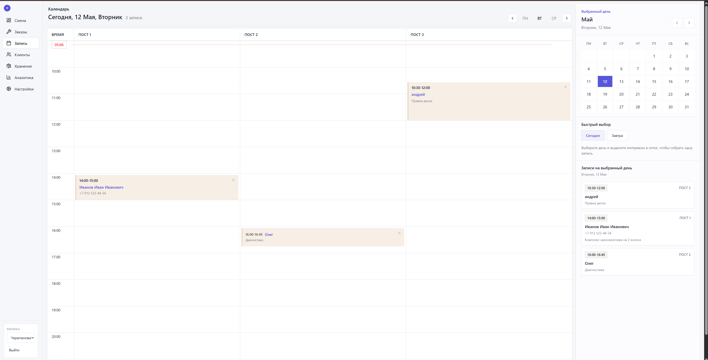
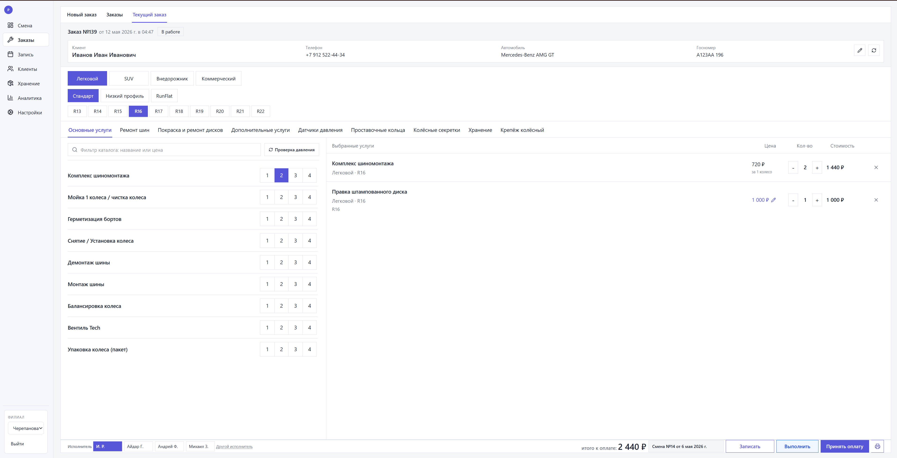
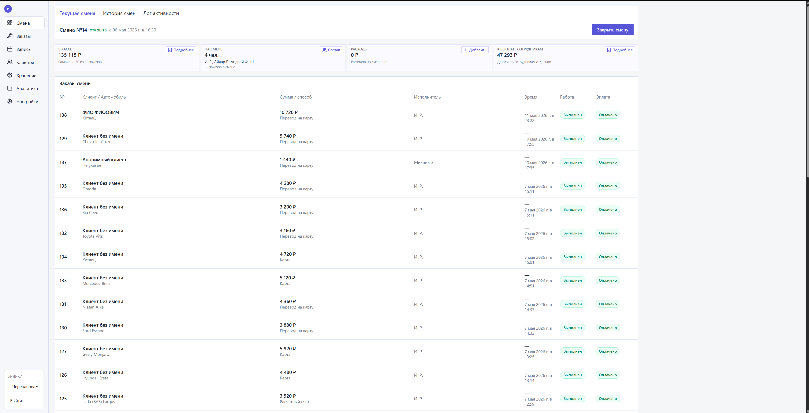
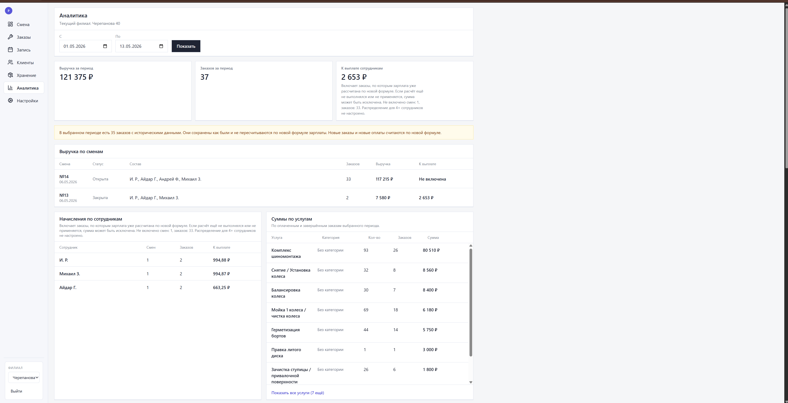
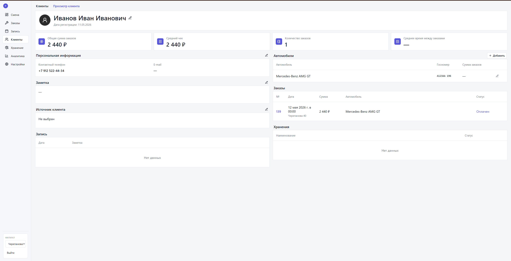
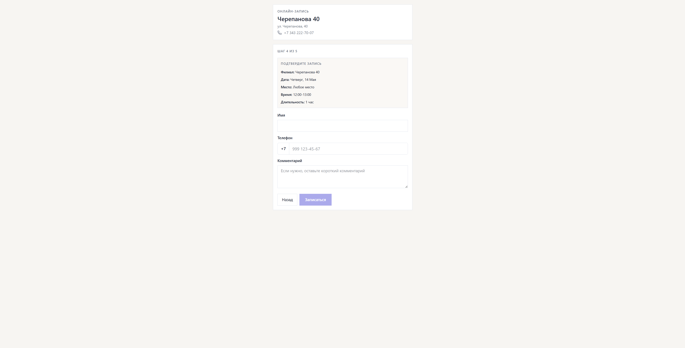
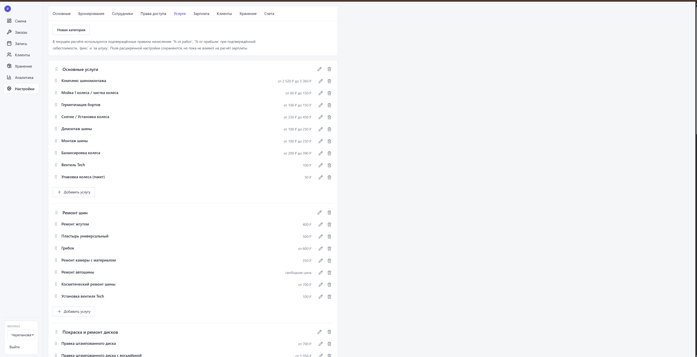
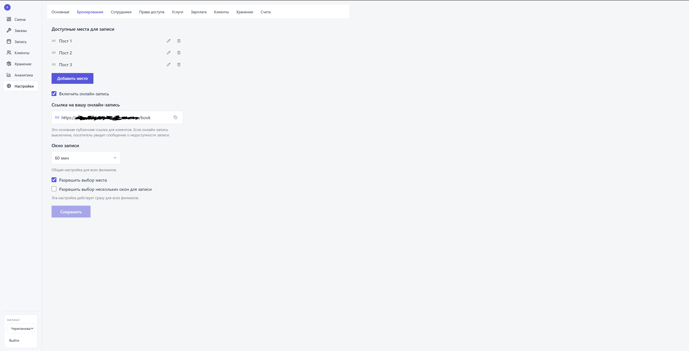

# Pegas Auto CRM — современная система управления сетью шиномонтажей

Это реальный коммерческий проект: полнофункциональная CRM/POS-платформа, разработанная для автоматизации сети шиномонтажных центров. Система объединяет в себе всё необходимое для бизнеса: от онлайн-записи клиентов до детальной аналитики и расчёта зарплат.

## Задача
Заменить разрозненные таблицы и ручной учёт на единую цифровую среду. Нужно было создать инструмент, который позволит управлять несколькими филиалами, координировать работу сотрудников и видеть прозрачную картину бизнеса в реальном времени.

## Что реализовано
*   **Управление заказами:** полный цикл обслуживания клиента, выбор автомобиля, подбор услуг и приём оплаты.
*   **Клиентская база:** детальная история обращений по каждому автомобилю и владельцу.
*   **Запись на обслуживание:** удобный календарь для сотрудников и публичная форма онлайн-записи для клиентов.
*   **Работа со сменами:** строгий кассовый учёт, открытие и закрытие рабочих дней.
*   **Автоматизация зарплат:** автоматический расчёт выплат мастерам на основе выполненных ими услуг.
*   **Гибкие настройки:** управление прайс-листами, категориями услуг и параметрами записи.
*   **Аналитика:** наглядные отчёты по выручке, популярности услуг и эффективности филиалов.
*   **Печать квитанций:** генерация квитанций 57 мм без фискализации.

## Ключевые технические решения
*   **Snapshot pattern:** финансовые параметры (цены, скидки) «замораживаются» в момент создания заказа. Это гарантирует неизменяемость истории и точность финансовой отчётности.
*   **Доступ к данным по филиалам (Branch-aware):** система строго разделяет данные. Сотрудники видят информацию только своего филиала, а владельцы — всю сеть.
*   **Repository pattern:** архитектурный подход, который отделяет бизнес-логику от прямого взаимодействия с базой данных, делая код чище и тестируемее.
*   **Feature-based архитектура:** модульная структура проекта, где каждая функция (заказы, смены, клиенты) изолирована, что упрощает масштабирование.
*   **TypeScript + Prisma:** обеспечивают строгую типизацию данных от базы до пользовательского интерфейса.

## Скриншоты

| Раздел | Скриншот |
| :--- | :--- |
| **Календарь записи** |  |
| **Оформление заказа** |  |
| **Текущая смена** |  |
| **Аналитика** |  |
| **Карточка клиента** |  |
| **Онлайн-запись** |  |
| **Настройка услуг** |  |
| **Настройка записи** |  |

## Мой вклад
Проект выполнен мной в формате **solo full-stack разработки**. Я отвечал за все этапы создания продукта: от проектирования архитектуры и схемы базы данных до реализации фронтенда, бэкенда и настройки прав доступа.

## Архитектура
*   **Frontend:** TypeScript, Next.js 16, React 19. Интерфейс адаптирован под быстрый ввод данных на рабочих местах и удобную онлайн-запись.
*   **Backend:** Server Actions, Repository pattern. Реализована сложная бизнес-логика жизненного цикла заказов и финансовых операций.
*   **Database:** PostgreSQL под управлением Prisma ORM.
*   **Контроль доступа:** Гибкая ролевая модель (владелец, администратор, менеджер, механик) в сочетании с территориальным разделением данных.

## Архитектурный срез
В папке [architecture-shell/](architecture-shell/) представлен **безопасно подготовленный архитектурный срез** системы. Это упрощённая версия структуры проекта, которая демонстрирует инженерные подходы без раскрытия коммерческой тайны.

В этом срезе можно увидеть:
*   Пример модульной структуры (запись, заказы, смены).
*   Логику разделения прав и доступа по филиалам.
*   Сервис управления жизненным циклом заказа.
*   Примеры реализации Snapshot pattern.
*   Выдержки из схемы базы данных и контракты репозиториев.

Все данные в этом разделе полностью обезличены. Подробнее читайте в [архитектурном описании среза](architecture-shell/README.md).

## Что опубликовано безопасно
Этот репозиторий является витриной проекта для портфолио. Здесь **не публикуются**: полный production-код, ключи доступа, реальные данные клиентов, настройки серверов и закрытая бизнес-логика.

В открытом доступе находятся:
*   Общее описание системы и принятых решений.
*   Архитектурный срез для демонстрации навыков проектирования.
*   Скриншоты интерфейса с демонстрационными данными.
*   Обезличенные примеры кода отдельных модулей.

## Примеры кода
Для ознакомления с качеством кода подготовлены следующие примеры:
*   [Расчёт зарплаты исполнителей](src-examples/payroll-calculator.example.ts)
*   [Жизненный цикл заказа](src-examples/order-workflow.example.ts)
*   [Права доступа и филиалы](src-examples/permissions.example.ts)
*   [Поток онлайн-записи](src-examples/booking-flow.example.ts)
*   [Модель данных (фрагмент)](src-examples/data-model-excerpt.example.ts)
*   [Доступ по филиалам](src-examples/branch-aware-access.example.ts)
*   [Repository pattern](src-examples/repository-pattern.example.ts)
*   [Утилиты для операций](src-examples/operational-utils.example.ts)

## Документация
*   [Подробная архитектура](docs/architecture.md)
*   [Описание модулей](docs/modules.md)
*   [Модель данных](docs/data-model.md)
*   [Технологический стек](docs/tech-stack.md)
*   [Сложные задачи и их решения](docs/challenges-and-solutions.md)
*   [Безопасность и приватность](docs/security-and-privacy.md)

## Статус
Проект работает в продакшене и используется в реальных рабочих процессах. Репозиторий служит демонстрацией архитектурного подхода и уровня реализации коммерческих систем.
